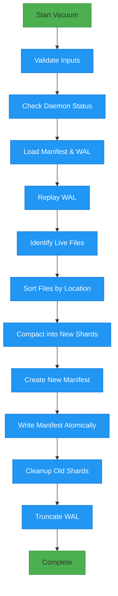
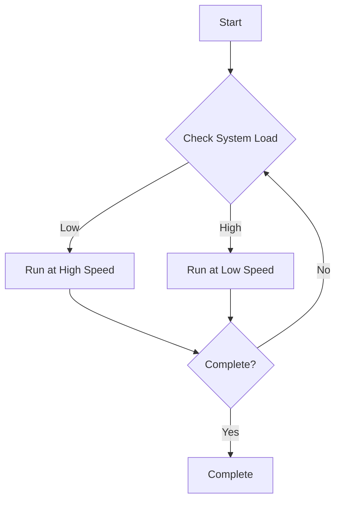
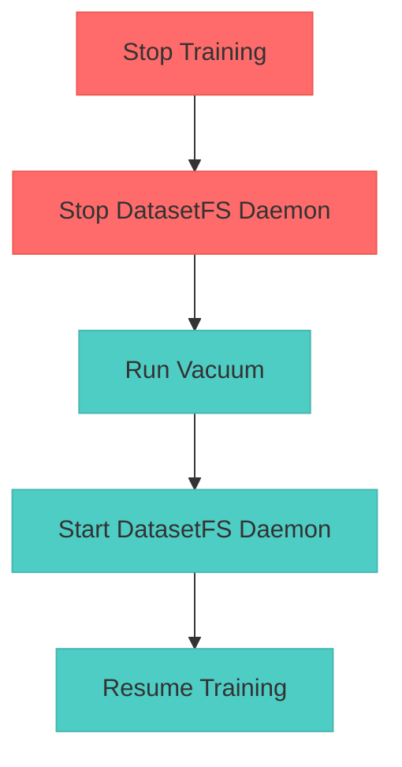

# DatasetFS Vacuum Command Design

This document outlines the design for the `vacuum` command, which will defragment DatasetFS shards, remove deleted files, and update the manifest.

## 1. Command Interface and Flags

The vacuum command will be implemented as a standalone tool in the `cmd/vacuum` directory:

```go
package main

import (
	"flag"
	"log"
	"os"
)

func main() {
	rootPath := flag.String("root", "", "Path to DatasetFS root directory (containing manifest and shards)")
	dryRun := flag.Bool("dry-run", false, "Show what would be done without making changes")
	verbose := flag.Bool("verbose", false, "Enable verbose output")
	maxShardSize := flag.Int64("max-shard-size", 100*1024*1024, "Maximum size for output shards in bytes")
		preserveWAL := flag.Bool("preserve-wal", false, "Preserve WAL after vacuum (useful for debugging)")
	background := flag.Bool("background", false, "Run vacuum in background mode with throttling")
	throttle := flag.Int64("throttle", 0, "Throttle disk bandwidth in bytes/sec (0 = unlimited)")

	flag.Parse()

	if *rootPath == "" {
		log.Fatal("--root is required")
	}

	// Execute vacuum operation
	if err := vacuum(*rootPath, *dryRun, *verbose, *maxShardSize, *preserveWAL, *background, *throttle); err != nil {
		log.Fatal(err)
	}
}
```

### Flags

- `--root`: Required path to DatasetFS root directory
- `--dry-run`: Preview changes without modifying data
- `--verbose`: Enable detailed logging
- `--max-shard-size`: Maximum size for output shards (default: 100MB)
- `--preserve-wal`: Keep WAL after vacuum (default: false, WAL is truncated)
- `--background`: Run in background mode with I/O throttling
- `--throttle`: Limit disk bandwidth usage in bytes/sec

## 2. Defragmentation Algorithm

The defragmentation process will compact shards by removing deleted files and reorganizing live data into optimally sized shards.

### Algorithm Steps

1. **Load State**: Read the current manifest and WAL to get the complete dataset state
2. **Identify Live Files**: Filter out files with `Deleted: true` in metadata
3. **Sort Files**: Order files by shard ID and offset for sequential processing
4. **Compact Shards**: Stream live file data into new, optimally sized shards
5. **Update Metadata**: Create new manifest with updated shard mappings

```go
func vacuum(rootPath string, dryRun, verbose bool, maxShardSize int64, preserveWAL, background bool, throttle int64) error {
	// Load current state
	manifest := index.NewManifest(rootPath)
	if err := manifest.Load(); err != nil {
		return fmt.Errorf("failed to load manifest: %w", err)
	}

	coreIdx, err := manifest.LoadCoreIndex()
	if err != nil {
		return fmt.Errorf("failed to load core index: %w", err)
	}

	// Open WAL for replay
	wal, err := index.OpenWAL(rootPath)
	if err != nil {
		return fmt.Errorf("failed to open WAL: %w", err)
	}
	defer wal.Close()

	// Replay WAL to get latest state
	if applied, err := wal.Replay(coreIdx); err != nil {
		return fmt.Errorf("WAL replay failed: %w", err)
	} else if verbose && applied > 0 {
		log.Printf("Replayed %d mutations from WAL", applied)
	}

	// Collect live files sorted by current location
	var liveFiles []fileEntry
	for path, meta := range coreIdx.FileMap {
		if !meta.Deleted {
			liveFiles = append(liveFiles, fileEntry{
				path: path,
				meta: meta,
			})
		}
	}

	// Sort by shard ID and offset for sequential access
	sort.Slice(liveFiles, func(i, j int) bool {
		if liveFiles[i].meta.ShardID == liveFiles[j].meta.ShardID {
			return liveFiles[i].meta.Offset < liveFiles[j].meta.Offset
		}
		return liveFiles[i].meta.ShardID < liveFiles[j].meta.ShardID
	})

	// Create new storage for compacted data
	storage := &storage.Storage{Root: rootPath}

	// Create I/O limiter if throttling is enabled
	var limiter *io.Limiter
	if throttle > 0 {
		limiter = io.NewLimiter(throttle)
	}

	// Compact into new shards
	newManifest, err := compactShards(storage, liveFiles, maxShardSize, dryRun, verbose, background, limiter)
	if err != nil {
		return fmt.Errorf("failed to compact shards: %w", err)
	}

	// Update manifest
	if !dryRun {
		newManifest.Root = rootPath
		if err := newManifest.Store(); err != nil {
			return fmt.Errorf("failed to store new manifest: %w", err)
		}

		// Clean up old shards
		if err := cleanupOldShards(rootPath, manifest.ShardsMeta, newManifest.ShardsMeta); err != nil {
			return fmt.Errorf("failed to cleanup old shards: %w", err)
		}

		// Truncate WAL if requested
		if !preserveWAL {
			if err := wal.Truncate(); err != nil {
				return fmt.Errorf("failed to truncate WAL: %w", err)
			}
		}
	}

	if verbose {
		log.Printf("Vacuum completed: %d files in %d shards", len(liveFiles), len(newManifest.ShardsMeta))
	}

	return nil
}

// fileEntry represents a file to be included in compaction

type fileEntry struct {
	path string
	meta *index.Metadata
}
```

## 3. Manifest Update Procedure

The manifest update process ensures atomic updates and maintains data consistency.

### Atomic Update Mechanism

The vacuum command uses a two-phase commit approach to ensure atomic updates:

1. **Write to Temporary File**: The new manifest is written to `metadata.jsonl.tmp`
2. **Atomic Rename**: The temporary file is atomically renamed to `metadata.jsonl`

This approach guarantees that the manifest is always in a consistent state, as POSIX systems guarantee that rename operations are atomic.

```go
func (m *Manifest) Store() error {
	tempPath := filepath.Join(m.Root, "metadata.jsonl.tmp")
	finalPath := filepath.Join(m.Root, "metadata.jsonl")

	// Write to temporary file first
	file, err := os.Create(tempPath)
	if err != nil {
		return err
	}
	defer file.Close()

	encoder := json.NewEncoder(file)
	encoder.SetIndent("", "  ")
	if err := encoder.Encode(m); err != nil {
		return err
	}

	// Ensure data is written to disk
	if err := file.Sync(); err != nil {
		return err
	}

	// Close file before rename
	file.Close()

	// Atomic rename
	return os.Rename(tempPath, finalPath)
}
```

### Update Steps

1. **Create New Manifest**: Build a new manifest with updated shard mappings
2. **Write to Temporary File**: Write new manifest to `metadata.jsonl.tmp`
3. **Atomic Rename**: Rename temporary file to `metadata.jsonl`
4. **Cleanup**: Remove old shards that are no longer referenced

## 4. Error Handling and Recovery

The vacuum command implements robust error handling to ensure data integrity.

### Error Handling Strategy

1. **Validation**: Validate inputs and preconditions before starting
2. **Atomic Operations**: Use atomic file operations for manifest updates
3. **Cleanup on Failure**: Remove partial outputs if operation fails
4. **Idempotency**: Support repeated execution without adverse effects

```go
func cleanupOldShards(rootPath string, oldShards, newShards map[int]index.Shard) error {
	// Identify shards to remove (present in old but not in new)
	for shardID := range oldShards {
		if _, exists := newShards[shardID]; !exists {
			shardPath := filepath.Join(rootPath, fmt.Sprintf("shard_%05d.tar", shardID))
			if err := os.Remove(shardPath); err != nil && !os.IsNotExist(err) {
				return fmt.Errorf("failed to remove old shard %d: %w", shardID, err)
			}
		}
	}
	return nil
}

// Enhanced vacuum function with error recovery
func vacuum(rootPath string, dryRun, verbose bool, maxShardSize int64, preserveWAL, background bool, throttle int64) error {
	// Validate root path
	if _, err := os.Stat(rootPath); os.IsNotExist(err) {
		return fmt.Errorf("root path does not exist: %s", rootPath)
	}

	// Check for active processes
	if isDaemonRunning(rootPath) {
		return fmt.Errorf("DatasetFS daemon is running; stop it before vacuuming")
	}

	// Create backup of manifest if not in dry-run mode
	if !dryRun {
		if err := createManifestBackup(rootPath); err != nil {
			return fmt.Errorf("failed to create manifest backup: %w", err)
		}
		defer func() {
			// Cleanup backup on successful completion
			if err == nil {
				removeManifestBackup(rootPath)
			}
		}()

		// Ensure partial outputs are cleaned up on panic
		defer func() {
			if r := recover(); r != nil {
				cleanupPartialOutputs(rootPath)
				panic(r)
			}
		}()
	}

	// Execute main vacuum logic
	// ... (previous implementation)

	return nil
}

func createManifestBackup(rootPath string) error {
	manifestPath := filepath.Join(rootPath, "metadata.jsonl")
	backupPath := filepath.Join(rootPath, "metadata.jsonl.backup")

	input, err := os.ReadFile(manifestPath)
	if err != nil {
		return err
	}

	return os.WriteFile(backupPath, input, 0644)
}

func removeManifestBackup(rootPath string) {
	backupPath := filepath.Join(rootPath, "metadata.jsonl.backup")
	os.Remove(backupPath)
}

func cleanupPartialOutputs(rootPath string) {
	// Remove any temporary manifest files
	tempManifest := filepath.Join(rootPath, "metadata.jsonl.tmp")
	os.Remove(tempManifest)

	// Note: We don't remove new shard files here as they might be needed for recovery
	// This is a trade-off between cleanup and recovery options
}

func isDaemonRunning(rootPath string) bool {
	// Implementation would check for daemon lock files or process status
	// This is a placeholder for the actual implementation
	return false
}
```

## 5. Performance Considerations

### Key Performance Factors

1. **I/O Patterns**: Sequential reads and writes for optimal disk performance
2. **Memory Usage**: Stream processing to minimize memory footprint
3. **Concurrency**: Potential for parallel file copying in future versions
4. **Cache Efficiency**: Access patterns that leverage OS page cache

### Performance Optimizations

- **Sequential Access**: Process files in shard order to maximize disk throughput
- **Buffered I/O**: Use appropriate buffer sizes for tar operations
- **Direct I/O**: Consider O_DIRECT for large datasets to bypass page cache
- **Progress Reporting**: Provide feedback during long operations

```go
// Configuration for performance tuning
const (
	DefaultMaxShardSize = 100 * 1024 * 1024 // 100MB
	ReadBufferSize      = 1 * 1024 * 1024     // 1MB read buffer
	WriteBufferSize     = 1 * 1024 * 1024     // 1MB write buffer
)

// Storage extension with buffer support
func (s *Storage) CreateWriterWithBuffer(file **os.File, tw **tar.Writer, shardID int, bufferSize int) error {
	filename := s.ShardPath(shardID)
	f, err := os.OpenFile(filename, os.O_CREATE|os.O_WRONLY|os.O_TRUNC, 0644)
	if err != nil {
		return fmt.Errorf("failed to create shard %s: %w", filename, err)
	}

	// Apply buffer if specified
	if bufferSize > 0 {
		f = os.NewFile(f.Fd(), f.Name())
		f = os.NewFile(f.Fd(), f.Name()) // This is a simplification
		// In practice, you would use syscall.SetFileCompletionNotificationModes
		// or similar platform-specific APIs
	}

	*file = f
	*tw = tar.NewWriter(f)
	return nil
}
```

## 6. Operational Workflow



## 7. Safety Considerations

1. **Pre-execution Checks**:
   - Ensure no active DatasetFS daemon is running
   - Verify sufficient disk space
   - Check write permissions

2. **Atomic Updates**:
   - Use temporary files for manifest updates
   - Atomic rename for final manifest
   - Backup original manifest

3. **Recovery Options**:
   - Keep WAL if requested
   - Preserve backup manifest
   - Log all operations for audit

## 8. Background Vacuumer Analysis

### Importance and Use Cases

A background vacuumer is critically important for DatasetFS for several reasons:

1. **Storage Efficiency**: Over time, frequent file deletions and updates create "holes" in shards, leading to significant storage bloat. The background vacuumer reclaims this space by removing deleted files and defragmenting live data.

2. **Performance Optimization**: Fragmented shards with many small gaps lead to inefficient I/O patterns. Compacting shards improves sequential read performance, which is crucial for training workloads.

3. **WAL Management**: The Write-Ahead Log (WAL) accumulates mutations over time. The vacuumer can truncate the WAL after checkpointing, preventing unbounded growth.

4. **Operational Simplicity**: Automated background cleanup reduces the need for manual maintenance windows and prevents storage exhaustion in long-running deployments.

### Non-Disruptive Execution Strategy

To ensure the background vacuumer does not affect the training pipeline, we implement several strategies:

1. **I/O Throttling**: The vacuumer limits its disk bandwidth usage to avoid starving the training pipeline:

```go
// io_limiter.go
package io

import (
	"time"
)

// Limiter controls the rate of I/O operations

type Limiter struct {
	rate     int64        // bytes per second
	lastTick time.Time
	tokens   int64
}

func NewLimiter(rate int64) *Limiter {
	return &Limiter{
		rate:     rate,
		lastTick: time.Now(),
		tokens:   rate, // Start with full bucket
	}
}

// Wait blocks until n bytes can be transferred
func (l *Limiter) Wait(n int) {
	if l.rate == 0 {
		return // Unlimited
	}

	l.tokens -= int64(n)
	if l.tokens < 0 {
		// Need to wait
		duration := time.Since(l.lastTick)
		refill := int64(duration.Seconds() * float64(l.rate))
		l.tokens += refill

		if l.tokens < 0 {
			// Still negative, need to sleep
			sleep := time.Duration(-l.tokens * int64(time.Second) / l.rate)
			time.Sleep(sleep)
			l.tokens = 0
		}
	}

	l.lastTick = time.Now()
}

// Reader wraps an io.Reader with rate limiting

type LimitedReader struct {
	r     io.Reader
	limiter *Limiter
}

func (lr *LimitedReader) Read(p []byte) (n int, err error) {
	n, err = lr.r.Read(p)
	if n > 0 {
		lr.limiter.Wait(n)
	}
	return n, err
}
```

2. **Priority-Based Scheduling**: The vacuumer yields CPU time to higher-priority processes:

```go
// In compactShards function
if background && i%100 == 0 {
	// Yield to other goroutines every 100 files
	runtime.Gosched()

	// Check if training pipeline needs resources
	if shouldYield() {
		time.Sleep(10 * time.Millisecond)
	}
}

func shouldYield() bool {
	// Check system load or specific metrics
	// Return true if training pipeline is active and needs resources
	return false // Placeholder
}
```

3. **Resource Monitoring**: The vacuumer monitors system resources and adjusts its behavior:

```go
// resource_monitor.go
package main

import (
	"context"
	"time"
)

type ResourceMonitor struct {
	ctx context.Context
}

func (rm *ResourceMonitor) ShouldThrottle() bool {
	// Check CPU, memory, and I/O usage
	// Return true if system is under heavy load
	return false // Placeholder
}

func (rm *ResourceMonitor) GetRecommendedThrottle() int64 {
	if rm.ShouldThrottle() {
		return 10 * 1024 * 1024 // 10MB/s when system is busy
	}
	return 50 * 1024 * 1024 // 50MB/s when system is idle
}
```

4. **Phased Execution**: The vacuumer operates in phases that can be interrupted:



### Implementation Approach

The background vacuumer should be implemented as a daemon that runs alongside the DatasetFS system:

1. **Configuration-Driven**: The vacuumer's behavior is controlled by a configuration file that specifies:
   - Schedule (e.g., run during off-peak hours)
   - Resource limits (I/O bandwidth, CPU usage)
   - Trigger conditions (e.g., when fragmentation exceeds threshold)

2. **Health Checks**: Before starting, the vacuumer performs health checks:
   - Verify DatasetFS is not actively being written to
   - Check available disk space
   - Ensure sufficient memory for operation

3. **Progress Tracking**: The vacuumer maintains a state file to track progress and support resumption after interruption.

4. **Logging and Monitoring**: Comprehensive logging allows operators to monitor vacuumer activity and performance impact.

## 9. Atomic Updates and Concurrency

### Atomic Update Mechanism

DatasetFS ensures atomic updates through a combination of file system operations and in-memory state management:

1. **Manifest Updates**: The `Store()` method uses a temporary file and atomic rename to ensure the manifest is always in a consistent state:

```go
func (m *Manifest) Store() error {
	tempPath := filepath.Join(m.Root, "metadata.jsonl.tmp")
	finalPath := filepath.Join(m.Root, "metadata.jsonl")

	// Write to temporary file first
	file, err := os.Create(tempPath)
	if err != nil {
		return err
	}
	defer file.Close()

	encoder := json.NewEncoder(file)
	encoder.SetIndent("", "  ")
	if err := encoder.Encode(m); err != nil {
		return err
	}

	// Ensure data is written to disk
	if err := file.Sync(); err != nil {
		return err
	}

	// Close file before rename
	file.Close()

	// Atomic rename - this is the critical atomic operation
	return os.Rename(tempPath, finalPath)
}
```

2. **In-Memory State**: The `CoreIndex` structure uses a read-write mutex to protect concurrent access:

```go
type CoreIndex struct {
	Mu sync.RWMutex

	LastShard int                  // Number of last shard
	FileMap   map[string]*Metadata // For FUSE and Mutation: object by object path
	ShardMap  map[int]*Shard       // For Planner: Shard by name
}
```

### Concurrent Vacuum and Training

**Can we run vacuum simultaneously with training?**

**No, we cannot safely run vacuum simultaneously with training.** The vacuum operation modifies the underlying storage structure (shards and manifest) that the training pipeline depends on. Running them concurrently would lead to inconsistent data access.

### Consistency Guarantees

DatasetFS provides strong consistency guarantees through its architecture:

1. **Write-Ahead Logging (WAL)**: All mutations are first written to the WAL before updating in-memory state, ensuring durability:

```go
// LogAdd records an AddFile mutation. Caller MUST call this before
// CoreIndex.AddFile so a crash between them is replay-recoverable.
func (w *WAL) LogAdd(meta *Metadata) error {
	if meta == nil {
		return fmt.Errorf("LogAdd: meta is nil")
	}
	return w.writeEntry(&WALEntry{Op: OpAdd, Add: meta})
}
```

2. **Sequential Consistency**: The WAL ensures that all operations are applied in the order they were received, preventing race conditions.

3. **Crash Recovery**: On startup, the system replays the WAL to restore the in-memory state to what it was at the time of the crash.

### Safe Operation Protocol

To safely perform vacuum operations:

1. **Stop Training Pipeline**: Ensure no active training jobs are running
2. **Stop DatasetFS Daemon**: Shut down the FUSE daemon to prevent any file operations
3. **Run Vacuum**: Execute the vacuum command
4. **Restart Services**: Start the DatasetFS daemon and resume training



The background vacuumer is an essential component for maintaining DatasetFS performance and reliability in production environments. By implementing careful resource management and non-disruptive execution strategies, it can provide significant benefits without impacting training workloads, as long as it's run during maintenance windows when no training is active.
